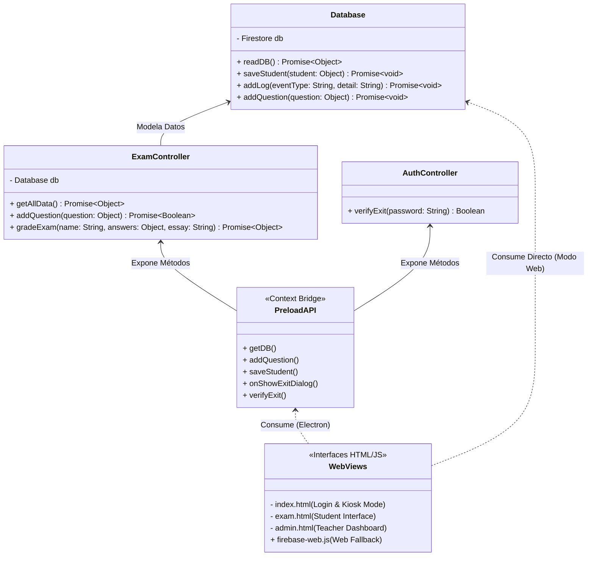

# Documentación Técnica: Sistema de Examen Seguro

## 1. Diagrama de Arquitectura (UML)

El sistema emplea una arquitectura basada en el patrón Modelo-Vista-Controlador (MVC) adaptada para entornos Electron y Web, garantizando una separación clara de responsabilidades.



## 2. Justificación del Diseño bajo Normas de Usabilidad (ISO 9241)

El diseño del Sistema de Examen Seguro ha sido fundamentado en la familia de normas **ISO 9241 (Ergonomía de la interacción humano-sistema)**, asegurando que la interfaz no solo sea funcional, sino que minimice la carga cognitiva y respete la accesibilidad universal.

### ISO 9241-11: Usabilidad (Eficacia, Eficiencia y Satisfacción)
- **Eficacia:** El estudiante puede completar el examen sin errores inducidos por la interfaz. El flujo de login es lineal y evita la pérdida accidental de progreso mediante el bloqueo agresivo del `unload` en Electron.
- **Eficiencia:** La recuperación de información es inmediata. Las opciones de opción múltiple utilizan controles nativos (`radio buttons`) amplios que cumplen con la Ley de Fitts, reduciendo el tiempo de selección.
- **Satisfacción:** Se removieron elementos visuales redundantes (como emojis excesivos) para mantener una estética profesional y limpia que reduce la fatiga visual.

### ISO 9241-112: Principios para la presentación de la información
- **Regla de Retención Cognitiva ($5 \pm 2$):** La carga de información se segmenta para no abrumar la memoria de trabajo del estudiante. El formulario del examen presenta los elementos en un flujo vertical con espaciado consistente, permitiendo una lectura jerárquica clara (Pregunta $\rightarrow$ Opciones $\rightarrow$ Siguiente Pregunta).
- **Consistencia Estética:** Todos los elementos interactivos (botones, campos de texto) mantienen el mismo *affordance* (apariencia de ser clicables).

### Criterios de Accesibilidad Universal Implementados
1. **Independencia del Color:** Ningún mensaje crítico confía únicamente en el color. Los errores ("Contraseña incorrecta") se muestran explícitamente mediante texto visible y no solo cambiando un borde a rojo.
2. **Flexibilidad de Entrada:** El modal de salida permite la validación tanto por clic del mouse (botón "Salir") como por la pulsación de la tecla `Enter`, acomodando distintos estilos de interacción y necesidades motoras.
3. **Manejo de Errores Claro:** Los mensajes informan de manera exacta qué sucedió y cómo resolverlo (Ej: "Por favor ingresa tu nombre", alertando inmediatamente sobre omisiones antes de avanzar).

## 3. Instrucciones de Ejecución

El sistema soporta una ejecución fluida bajo dos modalidades gracias a su arquitectura desacoplada:

### Modo Escritorio (Electron LockDown)
Para iniciar la aplicación local en modo quiosco de seguridad restringida:
```bash
npm install
npm start
```
*Características:* Pantalla completa inamovible, desactivación de portapapeles, deshabilitación de atajos de sistema (Alt+Tab, Ctrl+W) y bloqueo de inspector de código.

### Modo Web Fallback
Para iniciar el entorno web e interactuar directamente con Firestore a través del navegador:
```bash
npm run web
```
*Características:* Corre un servidor HTTP local en `http://localhost:8080` para evitar los bloqueos de seguridad del navegador al cargar módulos de Javascript locales (`ES Modules` vía protocolo `file://`).
